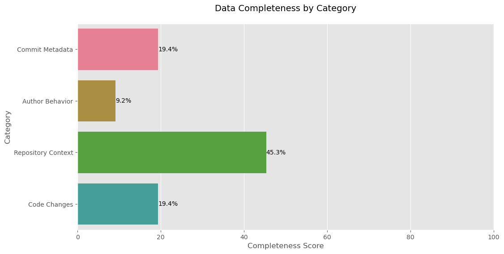
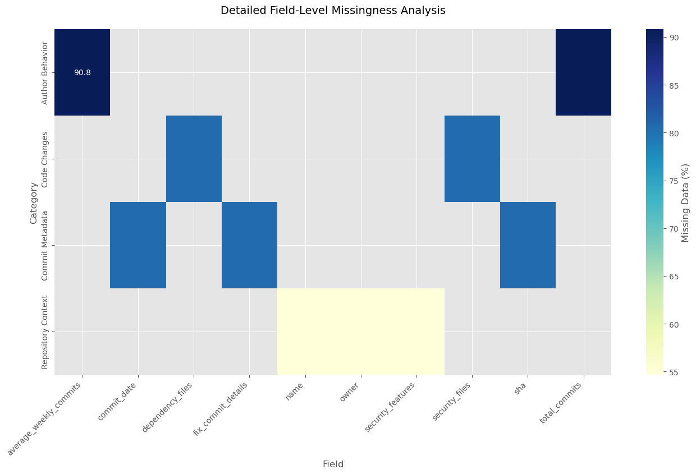
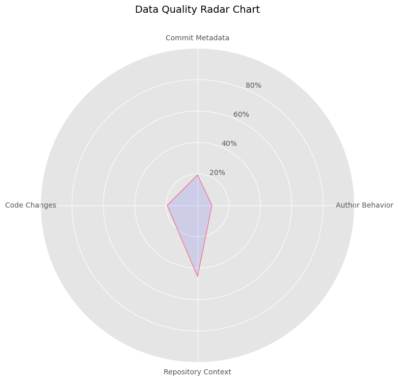

# Data Quality Assessment Report
## Executive Summary
- **Total Records Analyzed**: 46,704
- **Overall Completeness Score**: 23.3%
### Key Completeness Scores:
- **Commit Metadata**: 19.4%
- **Author Behavior**: 9.2%
- **Repository Context**: 45.3%
- **Code Changes**: 19.4%
## Root Cause Analysis
### Commit Metadata
Deleted repositories or force-pushed commit history
### Author Behavior
Private contributor profiles or API rate limiting
### Repository Context
Archived/renamed repositories or access restrictions
### Code Changes
Patch files unavailable or non-parseable diffs
## Visual Analysis
### Data Completeness by Category

### Temporal Missingness Pattern

### Field-Level Missingness Heatmap

### Data Quality Radar Chart

## Recommendations
1. **Priority Enhancement**: Focus on Commit Metadata collection (most impactful)
2. **Fallback Strategies**: Implement repository-level averages for author stats
3. **Data Supplementation**: Use Archive.org for deleted repositories
4. **Validation Pipeline**: Add automated completeness checks to collection workflow